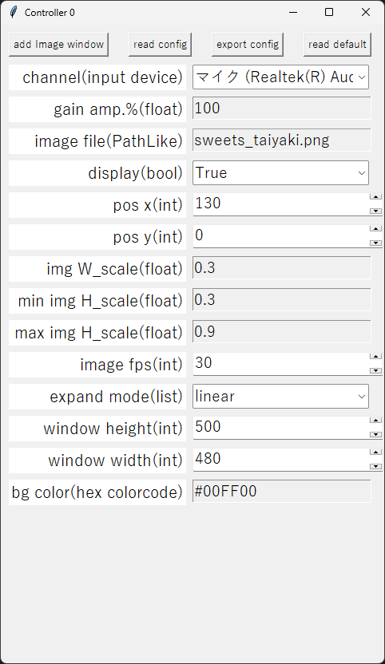

# expand_taiyaki_
## Abstract
This python program files provide 2D visualizer for \_taiyaki\_ stream.

## Requirements
* OS:Windows 10 or 11
* Software:python3 (Not anaconda, recommended: version 3.11)

## クイックガイド
* "Launch_in_venv.bat"をダブルクリックすることで簡単にプログラムを起動できます。
初めての起動の場合、 script/venv 内に外部ライブラリがpipコマンドでインストールされます。インストールにはインターネット環境が必要です。
その後、"Controller \[0-9\]" と "Image window \[0-9\]" の2つのウィンドウが表示されます。"Controller \[0-9\]"が設定ウィンドウ、"Image window \[0-9\]"が画像表示用ウィンドウです。
* プログラムを終了する場合、次の3つのうちどれか1つを行ってください。
    1. "Controller \[0-9\]"の×ボタンをクリックする。
    2. "Image window \[0-9\]"の×ボタンをクリックする。
    3. "Image window \[0-9\]"がアクティブの状態でESCキーを押す。

    __コンソールウィンドウを閉じないでください。プログラムは終了しますが、次回の起動が正常に行われなくなります。__

## 操作方法

#### ボタン
* add image window:新しくImage Windowを生成します。Controllerの設定が反映されます。Image Windowを閉じた時、そのImage Windowが最後の1つであればプログラムは終了します。
* read config:設定ファイルを読み込みます。
* export config:現在の設定をファイルに出力します。
* read default:設定を初期状態に戻します。

#### 設定入力欄
* channel (プルダウン):使用するマイクデバイスを変更できます。マイクデバイスを新たに接続した場合は、恐れ入りますがプログラムを再起動してください。
* gain apm.% (小数値):マイクからの音量のゲイン率です。画像への挙動が小さい場合はここの値を大きくしてください。
* image file (ファイルマネージャー):クリックするとファイルマネージャーが開き、表示する画像を変更できます。scriptフォルダ以外から画像が選択された場合、その画像はscriptフォルダにコピーされてから読み込まれます。この時、既にscriptフォルダ内に同じ名前のファイルが存在した場合、scriptフォルダのファイル名が変わります。
* display (プルダウン):画像の表示(True)/非表示(False)を切り替えられます。
* pos x (整数値):画像の水平方向表示位置(Image windowの左端からの位置)です。右方向が正であり、単位はピクセルです。
* pos y (整数値):画像の垂直方向表示位置(Image windowの下端からの位置)です。上方向が正であり、単位はピクセルです。
* img W_scale (小数値):画像の横方向の拡大率です。1.0にするとオリジナルの画像と同じ大きさで表示されます。
* min img H_scale (小数値):音声入力がない時の画像の縦方向の拡大率です。1.0にするとオリジナルの画像と同じ大きさで表示されます。img W_scaleと同じ値を推奨します。
* max img H_scale (小数値):音声入力が100%の時の画像の縦方向の拡大率です。これ以上画像の縦方向は伸びなくなります。
* expand mode (プルダウン):linearを推奨します。(申し訳ないのですが、説明を省略します。)
* window height (整数値):Image windowのウィンドウの横幅です。単位はピクセルです。
* window width (整数値):Image windowのウィンドウの高さです。単位はピクセルです。
* bg color (文字列):Image Windowの背景色です。 16進数の6桁または3桁のRGBカラーコード(例: "#00FF99" or "#0F9") もしくは英語の色名(red,blue,green,yellow等)を使用できます。

## Requirements (python libraries)
__"Launch_in_venv.bat"からプログラムを起動する場合、これらのライブラリを事前にインストールする必要はありません。__
venvを使わない場合は、下記のライブラリをインストールした上で、scriptフォルダの"launcher.bat"または"volimg_ctrl.py"を開いてください。
* numpy>=1.24.4
* Pillow>=10.0.0
* PyAudio>=0.2.12
* pygame>=2.3.0
* webcolors>=1.13

